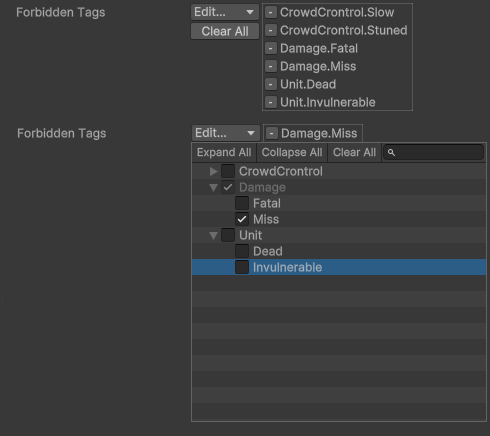

# Gameplay Tags for Unity

## Overview

<div align="center">
    
</div>

This project is an implementation of gameplay tags, similar to those found in Unreal Engine, for use in Unity. Gameplay tags are a flexible and efficient way to handle and categorize gameplay-related properties and states.

## Features

- Tag-based system for categorizing and managing gameplay elements.
- Easy integration with existing Unity projects.
- Flexible tagging system to suit a wide variety of use cases.

## Installation

1. Clone the repository or download the latest release.
2. Open your Unity project.
3. Add the package to your project using the Unity Package Manager:
   - Click on `Window -> Package Manager`.
   - Click the `+` button and select `Add package from git URL...`.
   - Enter the following URL:
     ```
     https://github.com/BandoWare/GameplayTags.git
     ```
   - Click `Add`.

## Usage

### Registering Tags

Gameplay tags are registered through attributes in the assembly. Here is an example:

```csharp
[assembly: GameplayTag("Damage.Fatal")]
[assembly: GameplayTag("Damage.Miss")]
[assembly: GameplayTag("CrowdControl.Stunned")]
[assembly: GameplayTag("CrowdControl.Slow")]
```

### GameplayTagCountContainer

`GameplayTagCountContainer` is a class used to manage gameplay tags with event callbacks for tag count changes. Here’s how to use it:

#### Creating a Tag Container

```csharp
GameplayTagCountContainer tagContainer = new GameplayTagCountContainer();
```

#### Adding a Tag

```csharp
GameplayTag tag = GameplayTagManager.RequestTag("ExampleTag");
tagContainer.AddTag(tag);
```

#### Removing a Tag

```csharp
tagContainer.RemoveTag(tag);
```

#### Registering a Callback for Tag Changes

```csharp
void OnTagChanged(GameplayTag tag, int newCount)
{
    Debug.Log($"Tag {tag.Name} count changed to {newCount}");
}

tagContainer.RegisterTagEventCallback(tag, GameplayTagEventType.AnyCountChange, OnTagChanged);
```

#### Removing a Callback

```csharp
tagContainer.RemoveTagEventCallback(tag, GameplayTagEventType.AnyCountChange, OnTagChanged);
```

#### Querying the Count of a Tag

```csharp
int tagCount = tagContainer.GetTagCount(tag);
Debug.Log($"Tag {tag.Name} has a count of {tagCount}");
```

#### Clearing All Tags

```csharp
tagContainer.Clear();
```

### GameplayTagContainer

`GameplayTagContainer` is a class for storing a collection of gameplay tags. It is serializable and provides a user-friendly interface in the Unity editor.

#### Creating a Tag Container

```csharp
GameplayTagContainer tagContainer = new GameplayTagContainer();
```

#### Adding a Tag

```csharp
GameplayTag tag = GameplayTagManager.RequestTag("ExampleTag");
tagContainer.AddTag(tag);
// or 
tagContaier.AddTag("ExampleTag");
```

#### Removing a Tag

```csharp
tagContainer.RemoveTag(tag);
```

#### Clearing All Tags

```csharp
tagContainer.Clear();
```

### Union and Intersection Operations

Union and intersection operations can be performed on any type of container that implements `IGameplayTagContainer`. These operations can be used to create new `GameplayTagContainer` instances.

#### Creating a Union of Tag Containers

```csharp
GameplayTagContainer union = GameplayTagContainer.Union(container1, container2);
```

#### Creating an Intersection of Tag Containers

```csharp
GameplayTagContainer intersection = GameplayTagContainer.Intersection(container1, container2);
```

## Differences between GameplayTagCountContainer and GameplayTagContainer

- **GameplayTagCountContainer**: Focuses on managing tags with the ability to register callbacks for when tag counts change. It is useful when you need to respond to tag count changes.
- **GameplayTagContainer**: Designed to store a collection of tags, it is serializable and offers a user-friendly interface in the Unity editor. It provides basic tag management without the event-driven functionality of `GameplayTagCountContainer`.

## License

This project is licensed under the Creative Commons Attribution 4.0 International (CC BY 4.0) License. See the [LICENSE](LICENSE.md) file for details.